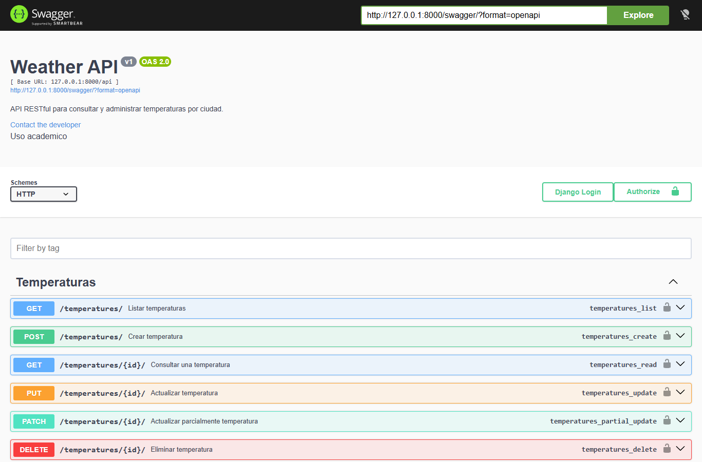

# Weather API - Documentacion Swagger

API RESTful desarrollada con Django REST Framework para administrar registros de temperatura por ciudad.

## Instalacion

```bash
python -m venv venv
venv\Scripts\activate
pip install -r requirements.txt
python manage.py migrate
python manage.py runserver
```

## Endpoints principales

| Metodo | Ruta | Descripcion |
| --- | --- | --- |
| GET | `/api/temperatures/` | Lista todas las temperaturas registradas. |
| POST | `/api/temperatures/` | Crea una temperatura. Requiere autenticacion. |
| GET | `/api/temperatures/{id}/` | Consulta una temperatura por ID. |
| PUT | `/api/temperatures/{id}/` | Actualiza completamente una temperatura. Requiere autenticacion. |
| PATCH | `/api/temperatures/{id}/` | Actualiza parcialmente una temperatura. Requiere autenticacion. |
| DELETE | `/api/temperatures/{id}/` | Elimina una temperatura. Requiere autenticacion. |

## Documentacion interactiva

Con el servidor activo, la documentacion se puede probar desde:

- Swagger UI: `http://127.0.0.1:8000/swagger/`
- Redoc: `http://127.0.0.1:8000/redoc/`
- Esquema JSON: `http://127.0.0.1:8000/swagger.json`

## Capturas

Las capturas de pantalla solicitadas para la actividad se guardan en la carpeta `docs/`.




## Revision final

- `drf_yasg` fue agregado a `INSTALLED_APPS`.
- Se configuraron rutas para Swagger UI, Redoc y esquema JSON.
- Los endpoints CRUD incluyen descripciones, parametros, cuerpos de solicitud y ejemplos de respuesta.
- Se limpiaron imports sin uso y comentarios generados automaticamente.
